# Clock Shop - Use Case Diagram

This document outlines the core use cases and functionality of the Clock Shop Management System.

```mermaid
flowchart LR
    %% Actors
    Admin(["Admin / Manager"])
    Cashier(["Cashier / Staff"])

    %% Authentication
    subgraph Auth [Authentication]
        UC_Auth("Login / Logout")
    end

    %% Point of Sale & Sales
    subgraph Sales [Point of Sale & Sales]
        UC_POS("Process Sale (POS)")
        UC_ViewSales("View Sales History")
        UC_PrintReceipt("Print Receipt / Invoice")
        UC_CancelSale("Cancel / Void Sale")
        UC_SalePayment("Accept Sale Payments")
    end

    %% Customer Management
    subgraph Customers [Customer Management]
        UC_ManageCustomers("Manage Customers")
        UC_ViewStatements("View Customer Statements")
        UC_CustomerPayment("Record Customer Payments")
    end

    %% Inventory Management
    subgraph Inventory [Inventory Management]
        UC_ManageProducts("Manage Products")
        UC_ManageCat("Manage Categories & Brands")
        UC_Purchases("Record Purchases (Restock)")
        UC_Stockout("Record Stockouts (Damage/Loss)")
    end

    %% Warehouse Management
    subgraph Warehouse [Warehouse Management]
        UC_ManageWarehouses("Manage Warehouses")
        UC_TransferStock("Transfer Stock")
    end

    %% Reports & Analytics
    subgraph Reports [Reports & Analytics]
        UC_Dashboard("View Dashboard")
        UC_ProfitReport("View Sales & Profit Reports")
        UC_StockReport("View Stock & Dead Stock Reports")
        UC_ExportPDF("Export Reports to PDF")
    end

    %% System Administration
    subgraph System [System Administration]
        UC_Settings("Manage System Settings")
        UC_AuditLogs("View Audit Logs")
    end

    %% Cashier Relationships
    Cashier --- UC_Auth
    Cashier --- UC_POS
    Cashier --- UC_ViewSales
    Cashier --- UC_PrintReceipt
    Cashier --- UC_SalePayment
    Cashier --- UC_ManageCustomers
    Cashier --- UC_CustomerPayment
    Cashier --- UC_Dashboard

    %% Admin Relationships
    Admin --- UC_Auth
    Admin --- UC_POS
    Admin --- UC_ViewSales
    Admin --- UC_CancelSale
    Admin --- UC_PrintReceipt
    Admin --- UC_SalePayment
    Admin --- UC_ManageCustomers
    Admin --- UC_ViewStatements
    Admin --- UC_CustomerPayment
    Admin --- UC_ManageProducts
    Admin --- UC_ManageCat
    Admin --- UC_Purchases
    Admin --- UC_Stockout
    Admin --- UC_ManageWarehouses
    Admin --- UC_TransferStock
    Admin --- UC_Dashboard
    Admin --- UC_ProfitReport
    Admin --- UC_StockReport
    Admin --- UC_ExportPDF
    Admin --- UC_Settings
    Admin --- UC_AuditLogs
```

### Feature Breakdown
1. **Sales & POS**: The core cash register system (`sale-create.js`), capable of searching products, selecting customers via TomSelect, adding discounts, calculating totals, and printing invoices without VAT/Tax logic.
2. **Customers**: Tracking walk-in and registered customers, their credit balances, and generating comprehensive statements.
3. **Inventory**: Full CRUD for products, tracking stock levels globally, and managing inward (purchases) and outward (stockouts) stock movements.
4. **Warehouses**: Managing multiple physical or logical storage locations and moving stock safely between them.
5. **Reports**: Data visualization for daily/monthly performance, dead stock identification, and printable batch reports.
6. **System**: Global settings management and action auditing for security.
